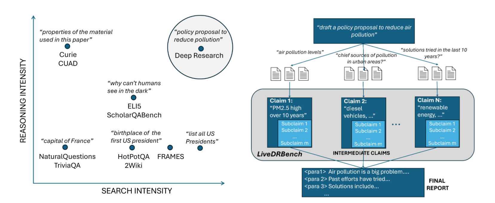

# LiveDRBench: Deep Research as Claim Discovery

[Arxiv Paper](https://arxiv.org/abs/2508.04183) | [Hugging Face Dataset](https://huggingface.co/datasets/microsoft/LiveDRBench) | [Evaluation Code](https://github.com/microsoft/LiveDRBench)

**Deep Research as Claim Discovery**: We propose a formal characterization of the deep research (DR) problem and introduce a new benchmark, _LiveDRBench_, to evaluate the performance of DR systems. To enable objective evaluation, we define DR using an intermediate output representation that encodes key claims uncovered during search—separating the reasoning challenge from surface-level report generation.



## Dataset Details

The benchmark consists of 100 challenging DR tasks over scientific topics (e.g., dataset discovery, materials discovery, novelty search, prior art discovery) and public interest events (e.g, the Oscars). The data was collected between May-June 2025. We plan to keep the benchmark live, and release periodic updates with new tasks.

Each task consists of (a) a prompt with a short description of the task and the expected output format; and (b) ground-truth JSON containing the claims and references that should be uncovered. We also include an evaluation script for computing the performance of DR systems using information-retrieval metrics namely precision, recall, and F1 scores.

The benchmark contains eight categories: SciFacts-Geo, SciFacts-Materials, NovelDatasets identification, NovelDatasets identification and extraction, NovelDatasets peer retrieval, PriorArt search, Entities, and Flight incidents.
A preview of the dataset can be obtained at [HuggingFace](https://huggingface.co/datasets/microsoft/LiveDRBench).

A detailed discussion of LiveDRBench, including how it was developed and tested, can be found in our [Arxiv paper](https://arxiv.org/abs/2508.04183).

## Usage

First, install the required dependencies:

```bash
pip install datasets openai tqdm 
```

To use LiveDRBench's questions, you can load the benchmark using the Hugging Face `datasets` library:

```python
from datasets import load_dataset

livedrbench = load_dataset("microsoft/LiveDRBench", "v1-full")['test']
```

To evaluate predictions on LiveDRBench, provide a predictions file with the following JSON schema:

```
[
  {
    "key": str,                             // Unique identifier from livedrbench.csv
    "preds": List[List[dict | str] | dict]  // Predictions in the format specified by each question in livedrbench.csv
  },
  ...
]
```

Then, run the evaluation script with an OpenAI API key. This script will compute **precision**, **recall**, and **F1** scores for each benchmark category.

```bash
python src/evaluate.py \
  --openai_api_key YOUR_API_KEY \
  --preds_file path/to/your/predictions.json \
  [--openai_model_name gpt-4o] \
  [--num_threads 8] \
  [--debug]
```

-   `--openai_api_key` (required): Your OpenAI API key.
-   `--preds_file` (required): Path to the predictions JSON file.
-   `--openai_model_name` (optional): Model to use as judge (default: gpt-4o).
-   `--num_threads` (optional): Number of parallel threads (default: 8).
-   `--debug` (optional): Enable debug mode, without multithreading.

## Intended Uses

LiveDRBench repository is best suited for loading the companion benchmark and evaluating existing models. The code and the benchmark are being shared with the research community to facilitate reproduction of our results and foster further research in this area. LiveDRBench is intended to be used by domain experts who are independently capable of evaluating the quality of outputs before acting on them.

## Out-of-scope Uses

-   LiveDRBench is not well suited for training new Deep Research models. It only provides a test set. To avoid accidental test set leakage, we encrypt the answers in the benchmark, following the procedure of [BrowseComp benchmark's release](https://github.com/openai/simple-evals/blob/main/browsecomp_eval.py).

-   LiveDRBench dataset is not as representative of all kinds of Deep Research queries, especially those that require assessing the writing quality of long reports.

-   We do not recommend using LiveDRBench repo or the dataset in commercial or real-world applications without further testing and development. They are being released for research purposes.

-   LiveDRBench should not be used in highly regulated domains where inaccurate outputs could suggest actions that lead to injury or negatively impact an individual's legal, financial, or life opportunities.

## Data Creation: Problem Inversion


Creating LiveDRBench involves a _problem inversion_ process that allows easy updation with new instances, given a set of existing reasoning problems. The first step is to find a
long-context or document reasoning problem that includes a question based on the document and its ground-truth answer. In the second step, this problem is inverted to create a new question asking for an event or entity consistent with the properties mentioned in an answer. In the third step, the question is refined (e.g., more properties are added) such that it admits a unique answer. Finally, the ground-truth set of reference documents is updated in case there are additional documents that provide the same answer.

For example, existing data from the [Curie](https://github.com/google/curie) benchmark consists of scientific papers and questions that could be answered based on each paper. The data was transformed to create questions that need to be answered without access to the paper, and thus involving non-trivial search and reasoning. The final ground-truth answers for each question were verified by MSR researchers.

While we aim to cover a broad set of scientific fields and world events in the dataset, the dataset primarily covers the fields of materials science, geospatial analysis, and computer science; and world events including flight incidents, the Oscars and Olympiads. We acknowledge that many scientific fields and geographic areas may not be well covered.

**Note**: LiveDRBench does not contain links to external data sources. LiveDRBench includes data from an existing scientific dataset, [Curie](https://github.com/google/curie). All queries are answerable using publicly available information.

## Best Practices

Best performance can be achieved by connecting an API key directly to the codebase. LiveDRBench should not be the only measure of understanding the performance of a DR model. Additional methods specific to the model use case should also be used to determine the overall performance of the model.

We strongly encourage users to use LLMs that support robust Responsible AI mitigations, such as Azure Open AI (AOAI) services. Such services continually update their safety and RAI mitigations with the latest industry standards for responsible use. For more on AOAI’s best practices when employing foundations models for scripts and applications:

-   [Blog post on responsible AI features in AOAI that were presented at Ignite 2023](https://techcommunity.microsoft.com/t5/ai-azure-ai-services-blog/announcing-new-ai-safety-amp-responsible-ai-features-in-azure/ba-p/3983686)

-   [Overview of Responsible AI practices for Azure OpenAI models](https://learn.microsoft.com/en-us/legal/cognitive-services/openai/overview)

-   [Azure OpenAI Transparency Note](https://learn.microsoft.com/en-us/legal/cognitive-services/openai/transparency-note)

-   [OpenAI’s Usage policies](https://openai.com/policies/usage-policies)

-   [Azure OpenAI’s Code of Conduct](https://learn.microsoft.com/en-us/legal/cognitive-services/openai/code-of-conduct)

Users are reminded to be mindful of data privacy concerns and are encouraged to review the privacy policies associated with any models and data storage solutions interfacing with LiveDRBench.

It is the user’s responsibility to ensure that the use of LiveDRBench repo and dataset complies with relevant data protection regulations and organizational guidelines.

## License

Code in this Github repository is licensed under the [MIT License](https://github.com/microsoft/livedrbench/blob/main/LICENSE).
The LiveDRBench dataset is released under the CDLA v2 license.

## Contact

If you have suggestions or questions, please raise an issue on Github or contact us at amshar@microsoft.com.

## Citing LiveDRBench

    @inproceedings{livedrbench2025,
      title={Characterizing Deep Research: A Benchmark and Formal Definition},
      author={Java, Abhinav and Khandelwal, Ashmit and Midigeshi, Sukruta and Halfaker, Aaron and Deshpande, Amit and Goyal, Navin and Gupta, Ankur and Natarajan, Nagarajan and Sharma, Amit},
      booktitle={arXiv preprint arXiv:2508.04183},
      year={2025}
    }
